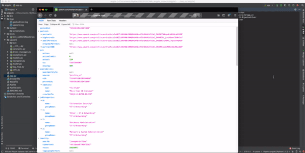

# UpWork Web Scraping Task

This is a project made in python + selenium to obtain data through the jobs and freelancers portal UpWork.com



See the complete execution on youtube: https://youtu.be/KoeZyorvBsU

Running with docker: https://youtu.be/9dqGqkUZ_TI


## Installation

Preparing the environment

```sh
pip3 install --upgrade pip
pip3 install --upgrade pipenv
pipenv install --deploy --system --dev
```

## Before start - Configure the .env file
Important to configure the .env file, it contains the necessary settings for the webscrap execution

```.env
USERNAME=<username>
PASSWORD=<password>
SECRET_ANSWER=<secret_answer>
TAKE_SCREENSHOTS=<1 or 0>
VERBOSE=<1 or 0>
```

## Usage 

To execute it just call the main file app.py

```sh
python3 app.py
```

## Usage with Docker

Build the Docker image:
```sh
make
```
Run the application:

```sh
make run
```

Open bash shell in Docker image:

```sh
make interactive
```

Run the application with custom volume parameters:

```sh
docker run -it -v ${PWD}/output:/opt/app/upwork/output -v ${PWD}/logs:/opt/app/upwork/logs  --env-file .env argyle_upwork 
```

Project Structure
============================


    .
    ├── bin             # Contains gecko binary - docker execution
    ├── docs            # ToDo
    ├── logs            # Logs folder for script execution and webdriver
    ├── output          # Output of screenshots and json files
    ├── tests           # ToDo - contains the base structure of tests files
    ├── upwork          # main folder with all classes and scripts
    ├── .env            # Access credentials and settings  
    ├── app.py          # Entrypoint 
    ├── Dockerfile      
    ├── Makefile        
    ├── Pipfile
    ├── Pipfile.lock
    └── README.md


## About me


### João Gabriel Lima
 
[Linkedin: @joaogabriellima/](https://www.linkedin.com/in/joaogabriellima/)

[Twitter: @joaogab93527273](https://twitter.com/joaogab93527273)
 
[Email: joaogabriellima.eng@gmail.com](mailto:joaogabriellima.eng@gmail.com)

[https://github.com/jgabriellima/](https://github.com/jgabriellima/)